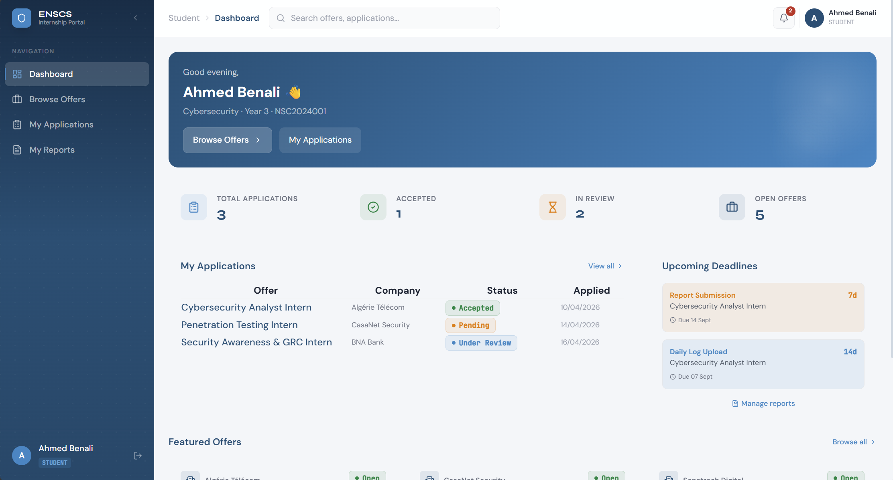
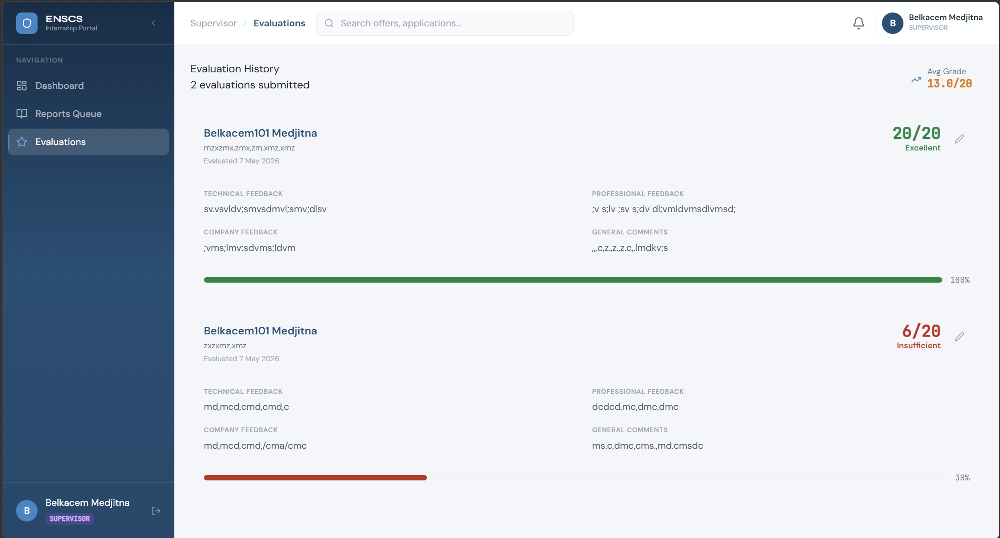
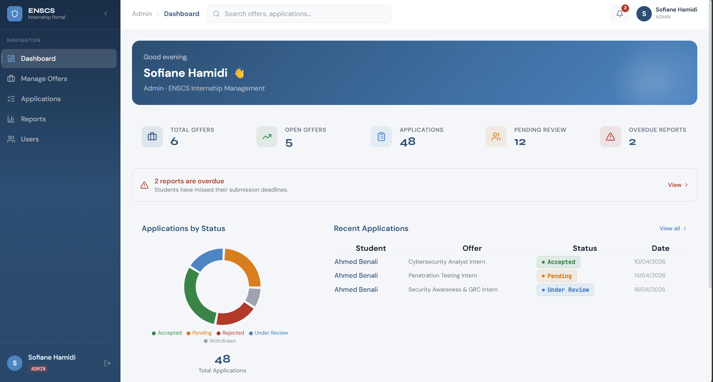

# ENSCS Internship Management System

<div align="center">


</div>

A full-stack web application that digitalises the internship lifecycle at the **National School of Cyber Security (NSCS), Algeria**.  
Built as a final project for the *Object-Oriented Programming with Java* module.

</div>

---

## Table of Contents

- [Overview](#overview)
- [Features](#features)
- [Tech Stack](#tech-stack)
- [OOP Principles](#oop-principles)
- [Architecture](#architecture)
- [Project Structure](#project-structure)
- [Getting Started](#getting-started)
- [API Reference](#api-reference)
- [Screenshots](#screenshots)

---

## Overview

The ENSCS Internship Management System replaces paper-based internship workflows with a centralised platform. It provides role-specific dashboards for three user types — **Students**, **Supervisors**, and **Administrators** — covering every stage of the internship process:

> Offer publication → Student application → Selection → Supervisor evaluation → Report submission

---

## Features

### Student
- Browse and search open internship offers
- Submit and track applications
- Upload internship reports (PDF / DOCX)
- View supervisor evaluations and scores

### Supervisor
- Create and manage internship offers
- Review student applications
- Submit structured evaluations with weighted criteria
- Track assigned students' progress

### Admin
- Full user management (create, update, deactivate)
- Approve or reject internship offers
- Platform-wide analytics dashboard
- Access to all applications and reports

---

## Tech Stack

| Layer | Technology |
|---|---|
| **Backend** | Java 17, Spring Boot 3, Spring Security, Spring Data JPA |
| **Frontend** | React 18, TypeScript, Tailwind CSS |
| **Database** | PostgreSQL, Hibernate ORM |
| **Authentication** | JWT (access + refresh tokens) |
| **State management** | Zustand |
| **Server state** | TanStack React Query |
| **Forms & validation** | React Hook Form + Zod |
| **Charts** | Recharts |
| **API docs** | SpringDoc OpenAPI / Swagger UI |
| **Build** | Maven (backend), Vite (frontend) |

---

## OOP Principles

This project demonstrates all core OOP principles required by the module brief. The backend is the primary showcase.

### Encapsulation
All JPA entity fields are `private`. State transitions are enforced through dedicated methods rather than direct field access:

```java
@Entity
public class Internship extends BaseEntity {
    private InternshipStatus status;  // private field

    public void publish() {
        if (this.status != InternshipStatus.DRAFT)
            throw new IllegalStateException("Only drafts can be published");
        this.status = InternshipStatus.OPEN;
    }
}
```

The controller layer never touches entity state directly — it delegates to services which work through these controlled methods.

---

### Inheritance
The user hierarchy uses JPA `@Inheritance(strategy = InheritanceType.JOINED)` — each subclass gets its own table, with shared columns in the `user` table.

```
User (abstract)
├── Student
├── Supervisor
└── Admin

Report (abstract)
├── InternshipReport
└── ProgressReport
```

A `@MappedSuperclass` `BaseEntity` provides `createdAt` / `updatedAt` audit fields to every entity without repetition.

---

### Polymorphism
Achieved through interface contracts and Spring's dependency injection:

```java
// Interface contract
public interface Evaluatable {
    double calculateScore();
    EvaluationStatus getEvaluationStatus();
}

// Runtime dispatch — Spring injects the correct implementation
@Autowired
private NotificationService notificationService; // EmailNotification or InAppNotification
```

`UserDetailsService.loadUserByUsername()` is overridden to return the correct authorities per user subtype.

---

### Abstraction
Every major service is defined as an interface; the controller layer depends only on the interface, never the implementation:

```java
public interface InternshipService {
    Page<InternshipDTO> getOpenOffers(Pageable pageable);
    InternshipDTO createOffer(CreateInternshipRequest req, Long supervisorId);
    void approveOffer(Long internshipId);
    void rejectOffer(Long internshipId, String reason);
}
```

---

### Interfaces

| Interface | Implementing class(es) | Purpose |
|---|---|---|
| `Evaluatable` | `Application`, `Internship` | Standardise evaluation scoring |
| `Submittable` | `Application`, `Report` | Enforce submit/withdraw lifecycle |
| `NotificationService` | `EmailNotificationService`, `InAppNotificationService` | Swap notification channel |
| `FileStorageService` | `LocalFileStorageService` | Abstract file upload target |
| `Reportable` | `InternshipReport`, `ProgressReport` | Common report operations |

---

### Exception Handling & Custom Exceptions

A typed exception hierarchy maps domain errors to HTTP status codes. A single `@RestControllerAdvice` handles all of them globally:

```java
// Base exception
public class AppException extends RuntimeException {
    private final HttpStatus status;
}

// Subtypes
public class ResourceNotFoundException extends AppException { ... }    // 404
public class DuplicateApplicationException extends AppException { ... } // 409
public class IncompleteReportException extends AppException { ... }    // 422
public class InvalidFileTypeException extends AppException { ... }     // 400
```

---

### Java Collections Framework

```java
// Grouping and aggregation with Stream API
Map<ApplicationStatus, Long> countByStatus = all.stream()
    .collect(Collectors.groupingBy(Application::getStatus, Collectors.counting()));

double avgScore = all.stream()
    .filter(a -> a.getEvaluationStatus() == EvaluationStatus.DONE)
    .mapToDouble(Application::calculateScore)
    .average().orElse(0.0);
```

`List`, `Map`, `Set`, and `Optional` are used throughout the service layer for aggregation, filtering, and null-safe access.

---

### File I/O

```java
@Service
public class LocalFileStorageService implements FileStorageService {
    private static final Set<String> ALLOWED = Set.of("pdf", "doc", "docx");

    @Override
    public String store(MultipartFile file, Long studentId) {
        String ext = getExtension(file.getOriginalFilename());
        if (!ALLOWED.contains(ext)) throw new InvalidFileTypeException(ext);

        String filename = studentId + "_" + UUID.randomUUID() + "." + ext;
        Files.copy(file.getInputStream(), storageRoot.resolve(filename));
        return filename;
    }
}
```

---

## Architecture

```
┌─────────────────────────────────┐
│   React 18 + TypeScript (SPA)   │
│   Zustand · React Query · Zod   │
└────────────┬────────────────────┘
             │  HTTPS / JSON (REST)
┌────────────▼────────────────────┐
│     Spring Boot 3 REST API      │
│  Spring Security · JWT · JPA    │
└────────────┬────────────────────┘
             │  JPA / Hibernate
┌────────────▼────────────────────┐
│         PostgreSQL 16           │
└─────────────────────────────────┘
```

### Backend layers

```
controller  →  service (interface + impl)  →  repository  →  database
                     ↑
                 model / dto
                 security
                 exception
```

---

## Project Structure

```
enscs-internship/
├── backend/
│   └── src/main/java/com/enscs/internship/
│       ├── controller/
│       │   ├── AuthController.java
│       │   ├── InternshipController.java
│       │   ├── ApplicationController.java
│       │   ├── ReportController.java
│       │   └── AdminController.java
│       ├── service/
│       │   ├── InternshipService.java          # interface
│       │   ├── InternshipServiceImpl.java
│       │   ├── ApplicationService.java         # interface
│       │   ├── ApplicationServiceImpl.java
│       │   ├── FileStorageService.java         # interface
│       │   └── LocalFileStorageServiceImpl.java
│       ├── repository/
│       │   ├── UserRepository.java
│       │   ├── InternshipRepository.java
│       │   └── ApplicationRepository.java
│       ├── model/
│       │   ├── User.java                       # abstract, @Inheritance JOINED
│       │   ├── Student.java
│       │   ├── Supervisor.java
│       │   ├── Admin.java
│       │   ├── Internship.java
│       │   ├── Application.java
│       │   └── report/
│       │       ├── Report.java                 # abstract
│       │       ├── InternshipReport.java
│       │       └── ProgressReport.java
│       ├── dto/
│       ├── security/
│       │   ├── JwtAuthenticationFilter.java
│       │   ├── JwtService.java
│       │   └── CustomUserDetailsService.java
│       └── exception/
│           ├── AppException.java
│           ├── ResourceNotFoundException.java
│           ├── DuplicateApplicationException.java
│           └── GlobalExceptionHandler.java
│
└── frontend/
    └── src/
        ├── api/                   # Axios instances & API functions
        ├── components/
        │   ├── common/            # Button, Input, Modal, Badge
        │   ├── layout/            # Sidebar, Topbar, PageWrapper
        │   └── forms/             # InternshipForm, ApplicationForm
        ├── pages/
        │   ├── auth/              # Login, Register
        │   ├── student/           # Dashboard, Browse, Applications
        │   ├── supervisor/        # Dashboard, Offers, Evaluations
        │   └── admin/             # Dashboard, Users, Stats
        ├── stores/                # Zustand: authStore, uiStore
        ├── hooks/                 # Custom hooks wrapping React Query
        ├── types/                 # TypeScript interfaces & enums
        └── utils/                 # Validators, formatters, constants
```

---

## Getting Started

### Prerequisites

- Java 17+
- Node.js 18+
- PostgreSQL 14+
- Maven 3.8+

### 1. Clone the repository

```bash
git clone https://github.com/your-username/enscs-internship.git
cd enscs-internship
```

### 2. Configure the database

Create a PostgreSQL database and update `backend/src/main/resources/application.properties`:

```properties
spring.datasource.url=jdbc:postgresql://localhost:5432/enscs_internship
spring.datasource.username=your_user
spring.datasource.password=your_password
spring.jpa.hibernate.ddl-auto=update

app.jwt.secret=your_jwt_secret_key_here
app.jwt.expiration=86400000
app.file.storage-path=./uploads
```

### 3. Run the backend

```bash
cd backend
mvn spring-boot:run
```

The API will be available at `http://localhost:8080`.  
Swagger UI: `http://localhost:8080/swagger-ui.html`

### 4. Run the frontend

```bash
cd frontend
npm install
npm run dev
```

The app will be available at `http://localhost:5173`.


## API Reference

All endpoints are under `/api/v1/`. Full documentation available at `/swagger-ui.html`.

| Method | Endpoint | Role | Description |
|---|---|---|---|
| `POST` | `/auth/login` | PUBLIC | Authenticate and receive JWT |
| `POST` | `/auth/register` | PUBLIC | Register a new student account |
| `GET` | `/internships` | PUBLIC | List open offers (paginated) |
| `POST` | `/internships` | SUPERVISOR | Create a new offer |
| `POST` | `/internships/{id}/approve` | ADMIN | Approve a pending offer |
| `POST` | `/internships/{id}/reject` | ADMIN | Reject a pending offer |
| `POST` | `/applications` | STUDENT | Submit an application |
| `GET` | `/applications/my` | STUDENT | Get own applications |
| `GET` | `/applications/{id}` | SUPERVISOR | View an application |
| `POST` | `/applications/{id}/evaluate` | SUPERVISOR | Submit evaluation |
| `POST` | `/reports/upload` | STUDENT | Upload internship report |
| `GET` | `/admin/users` | ADMIN | List all users |
| `GET` | `/admin/stats` | ADMIN | Platform-wide statistics |

---

## Screenshots


| Student Dashboard | Supervisor Dashboard | Admin Dashboard |
|---|---|---|
|  |  |  |

---

<div align="center">
  <sub>Final Project — OOP with Java · National School of Cyber Security · Algeria · 2026</sub>
</div>
